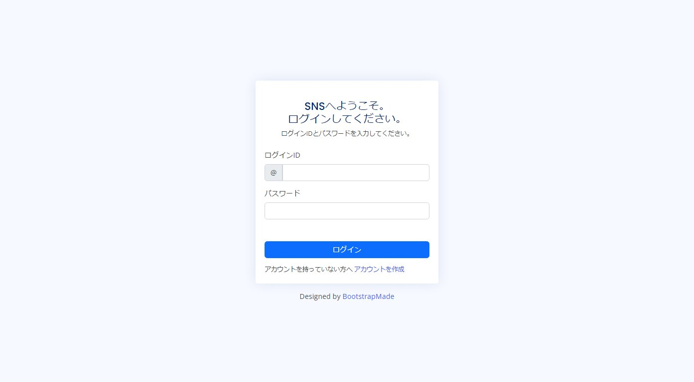
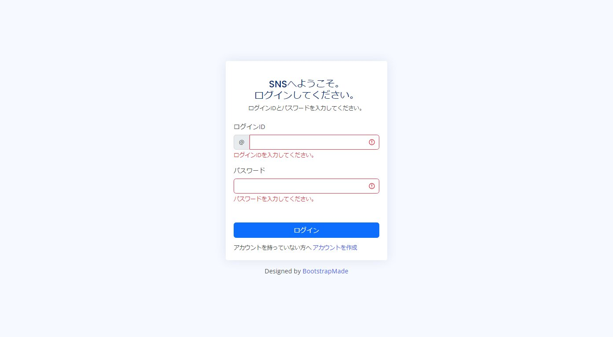
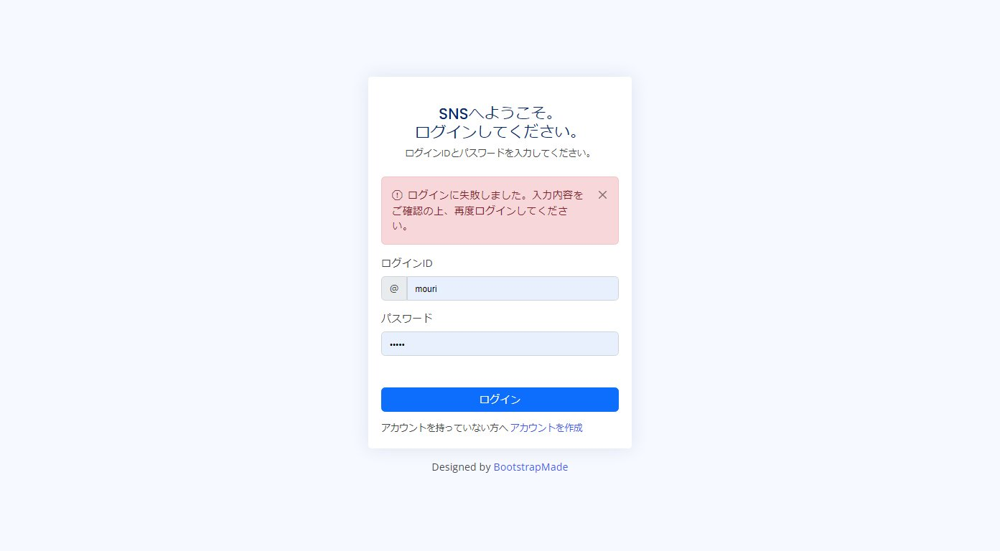
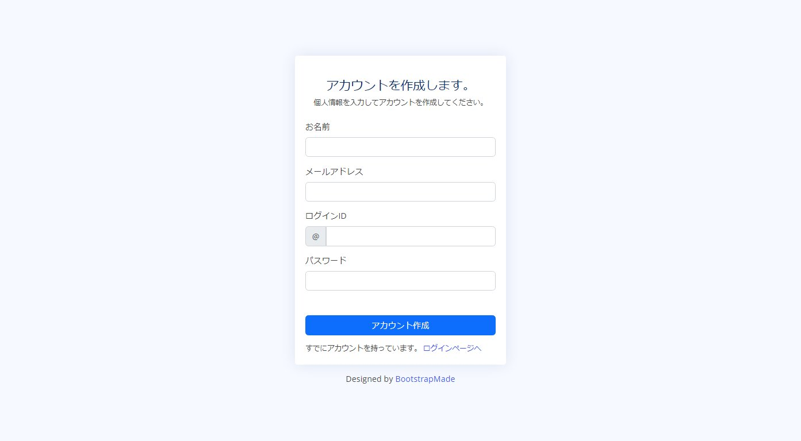

# EngineersGate Webアプリケーションオリジナル課題2

Webアプリケーションオリジナル課題2「SNSサイト」の制作物になります。


## 目的

Webアプリケーションオリジナル課題2「SNSサイト」の制作物として、
下記を実装しました。

- ログインページ
- アカウント作成ページ
- ダッシュボードページ
- プロフィールページ
- フレンドページ
- エラーページ


## 設計

使用した技術、実行環境及び設計は以下になります。

### 実行環境

- OS：Windows10
- IDE：Eclipse 2022-12
- Java：1.8.0_231
- SpringBoot：3.0.4
    - その他参照ライブラリは [build.gradle](https://github.com/hide-mouri/engineers_gate_springboot/blob/main/build.gradle) 参照
- MySQL：8.0.32

### DB設計


### パッケージ構成

```
src
└─main
    ├─java
    │  └─jp
    │      └─dcworks
    │          └─engineersgate
    │              └─egsns
    │                  ├─controller      # コントローラクラス
    │                  ├─core            # コアクラス。アプリ基底処理及び、設定に関する処理。
    │                  │  └─annotation
    │                  ├─dto             # DTOクラス。入力フォーム関連。
    │                  ├─entity          # DBエンティティクラス。
    │                  ├─repository      # DBアクセス。
    │                  ├─service         # リポジトリをラップしたサービスクラス。他、必要に応じて外部連携等コンポーネント。
    │                  └─util            # ユーティリティクラス。
    └─resources
        ├─static                         # 静的ファイル。js、css等。
        │  └─assets
        └─templates                      # テンプレートファイル。
           ├─account
           ├─common
           ├─error
           ├─friend
           ├─home
           ├─login
           └─profile
```


## 画面説明

### ログインページ

ログイン機能を実装しました。



- 「ログインID」「パスワード」を入力し、ログインします。
- 「ログインID」「パスワード」は必須入力です。



- 「ログインID」「パスワード」を入力しなかった場合、jsでバリデーションを行いエラーとします。



- ユーザーが存在しない場合は、サーバサイドでバリデーションを行いエラーとします。

------------------------

### アカウント作成ページ

アカウント作成機能を実装しました。



- 「お名前」「メールアドレス」「ログインID」「パスワード」を入力し、アカウント作成します。
- 「お名前」「メールアドレス」「ログインID」「パスワード」は必須入力です。


- 「お名前」「メールアドレス」「ログインID」「パスワード」を入力しなかった場合、jsでバリデーションを行いエラーとします。


- すでに登録済みのアカウントを登録すると、サーバサイドでバリデーションを行いエラーとします。


- アカウントの登録が完了すると、アカウント作成完了ページへ遷移します。


------------------------

### ダッシュボードページ

ダッシュボード機能を実装しました。


- データ0件の表示になります。


- ブログが投稿されている時の表示になります。
- SNSを利用しているユーザーの投稿が閲覧できます。


- 「タイトル」「本文」は必須入力です。
- 未入力の場合、サーバサイドでバリデーションを行いエラーとします。


- 「コメント」は必須入力です。
- 未入力の場合、サーバサイドでバリデーションを行いエラーとします。


------------------------

### プロフィールページ

プロフィールページ機能を実装しました。


- データ0件の表示になります。

　

- ブログが投稿されている時の表示になります。
- 個別のユーザーの投稿が閲覧できます。

　

- 自身のプロフィールを編集できます。
    - 「名前」「メールアドレス」は必須入力です。
    - 未入力の場合、サーバサイドでバリデーションを行いエラーとします。
- 自身のパスワードを編集できます。
    - 「パスワード」は必須入力です。
    - 未入力の場合、サーバサイドでバリデーションを行いエラーとします。


------------------------

### フレンドページ

フレンドページ機能を実装しました。


- データ0件の表示になります。


- フレンドが投稿されている時の表示になります。
- フレンド申請、解除が出来ます。


